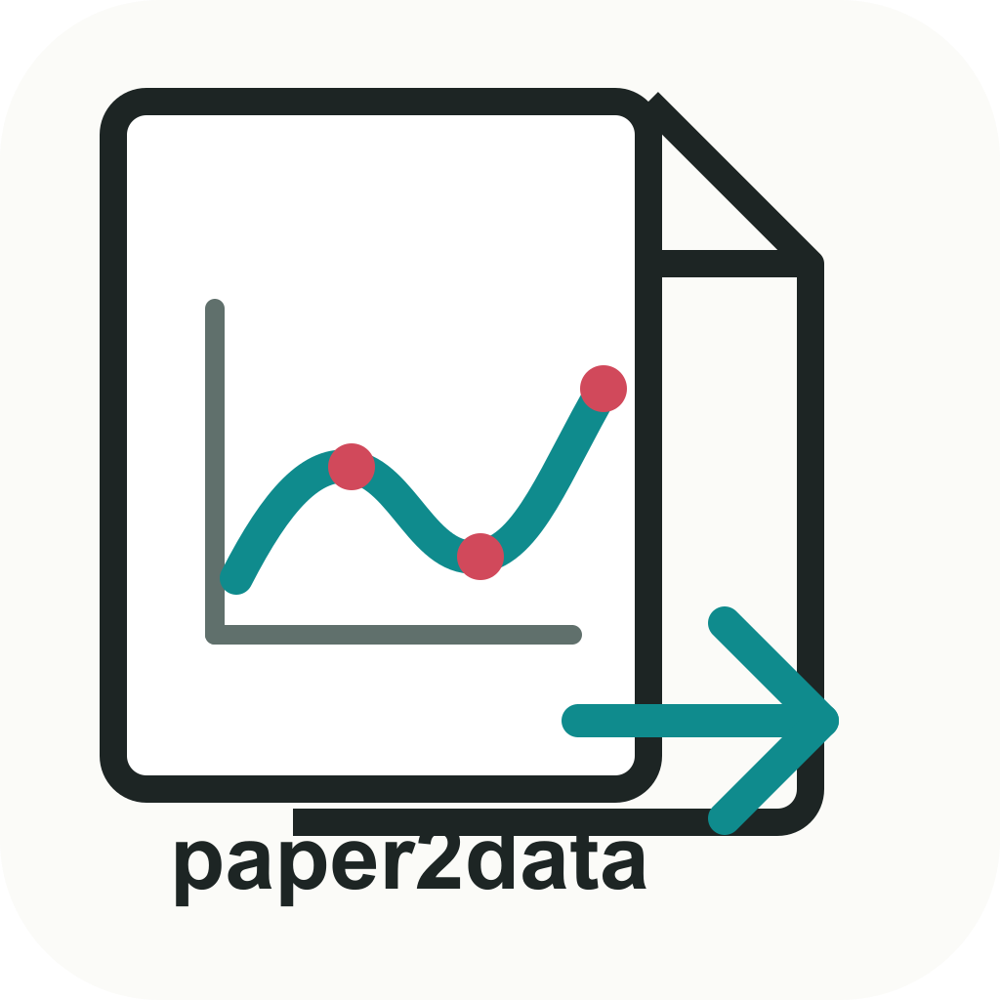

<p align="center">
  
</p>

# paper2data

`paper2data` is a small local Linux app for extracting calibrated data from
vector plots in PDF papers. It renders PDF pages as SVG, lets you click the
actual SVG paths and tick marks, and exports two-column `.dat` files or CSV.

It is intentionally SVG-only. If a paper embeds a plot as a raster image,
there will be no selectable curve path to extract.

## Install

On Ubuntu/Debian-like Linux systems:

```bash
sudo apt install nodejs npm mupdf-tools poppler-utils
git clone https://github.com/liambern/paper2data.git
cd paper2data
npm start
```

Open:

```text
http://localhost:5177
```

The app has no npm package dependencies. It needs:

- `node` for the local server
- `mutool` from `mupdf-tools` to render PDF pages as SVG
- `pdfinfo` from `poppler-utils` to read page counts

If your system package manager provides an old Node version, install Node 20+
or newer and rerun `npm start`.

## Workflow

1. Click `Open PDF`.
2. Pick the page containing the plot.
3. Use mouse wheel zoom and `Pan` mode to focus on the plot.
4. In `Select` mode, hover SVG paths to highlight them and click the curve you
   want. Shift-click adds multiple path segments.
5. In `Calibrate` mode, click `X1`, `X2`, `Y1`, and `Y2` tick marks. When you
   click a selectable SVG tick/path, paper2data uses the center of that SVG
   object rather than the raw mouse point.
6. Enter the numeric axis values for `X1`, `X2`, `Y1`, and `Y2`.
7. Set optional `Points`, `X min`, and `X max`.
8. Export `DAT` or `CSV`.

## Output

DAT output is the default and contains exactly two whitespace-separated columns
with no header:

```text
x y
```

CSV output contains:

```text
x,y
```

`Step` controls the internal SVG-path sampling density. `Points`, when set,
resamples the selected curve to exactly that many evenly spaced x-values over
the requested range.

## Notes

- Best results come from PDF figures that preserve plot curves as vector paths.
- Multi-line plots may represent one visible curve as several SVG path
  segments; use Shift-click and the selected-path list when needed.
- The app runs locally. Uploaded PDFs stay on your machine in `.paper2data/`.
